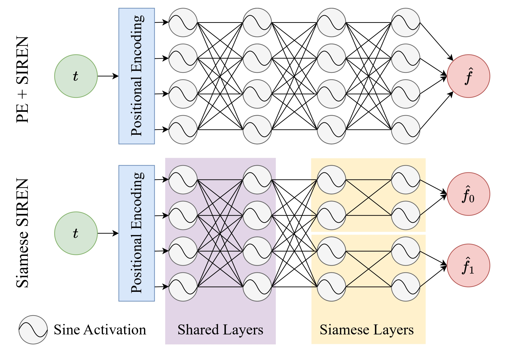

# Siamese SIREN: Audio Compression with Implicit Neural Representations

## [Paper](www.example.com) | [Examples](www.example.com)

## Repository Overview
The repository contains the following files:
* dataset.py: downloads and prepares the data, either GTZAN or LibriSpeech (note: GTZAN needs to be downloaded manually)
* model.py: contains the positional encoding, siren, sine layer, and siamese siren definitions
* model_config.py: contains different model configurations for easier sweeping
* run_sweep.py: sweeps over different model configurations by training on a dataset and stores various results in npy files
* train_and_eval_siam.py: trains a (Siamese) SIREN on a single sample and outputs various results.
* environment.yml: contains the anaconda environment with python package dependencies

## Environment Setup
Run the following snippet inside the project directory:
<pre><code>
conda env create --file environment.yml
conda activate siamese-siren
</code></pre>

## Quick intro to Implicit Neural Representations (INRs)
INRs can be used to represent (and store) data. If we think of an audio waveform as a function f, where f(t) is the wave amplitude at time t, we can try to learn this function. We normalize t into the range [-1,1].
An INR learns to approximate this function f. Therefore, we can store the weights of the learned INR which now encodes the audio. When we want to reconstruct the audio
we simply evaluate the INR for t in the interval [-1, 1]. INRs have some interesting properties (e.g. they are resolution-invariant) – the weights of the INR do not change depending on
the sampling rate of the audio, and we can sample dynamically at any arbitrary sampling rate at runtime.
